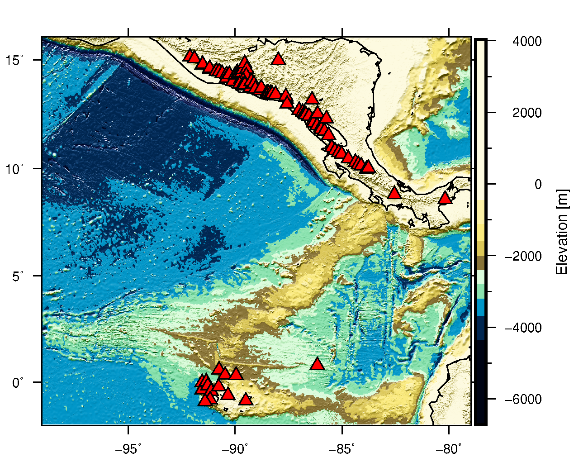

# Cocos Ridge and Central America Volcanoes

This scripts produce this image:

1. Download volcanoes database from the [GVP website](https://volcano.si.edu/list_volcano_holocene.cfm)

2. Open the `xls` file in Excel, erase the first row and save it as `xlsx`

3. Go to [GMRT MapTool] (https://www.gmrt.org/GMRTMapTool/), crop the area between `xmin`, `xmax`, `ymin` and `ymax` and download a GMT v3 Compatible NetCDF.
